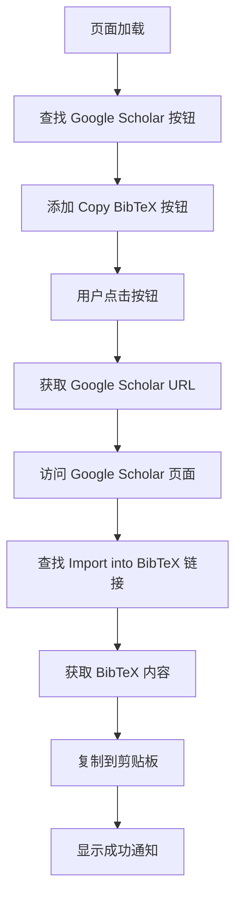

# ScienceDirect BibTeX 自动获取工具

一个强大的 Tampermonkey 用户脚本，用于在 ScienceDirect 网站上自动获取文献的 BibTeX 引用格式。该脚本会在 Google Scholar 按钮旁边添加一个"Copy BibTeX"按钮，点击即可直接复制 BibTeX 内容到剪贴板。

## 🚀 功能特性

- **一键获取**：在 Google Scholar 按钮旁边添加"Copy BibTeX"按钮
- **自动复制**：获取 BibTeX 后自动复制到剪贴板
- **智能识别**：自动识别页面上的 Google Scholar 链接
- **动态支持**：支持页面动态加载的内容
- **错误处理**：完善的错误处理和用户反馈机制
- **样式美观**：与 ScienceDirect 网站风格一致的按钮设计

## 📋 系统要求

- **浏览器**：Chrome、Firefox、Edge、Safari 等现代浏览器
- **扩展程序**：Tampermonkey 或 Greasemonkey
- **网络**：能够访问 Google Scholar 的网络环境

## 🛠️ 安装方法

### 方法一：通过 Tampermonkey 安装（推荐）

1. **安装 Tampermonkey 扩展**
   - Chrome: [Chrome Web Store](https://chrome.google.com/webstore/detail/tampermonkey/dhdgffkkebhmkfjojejmpbldmpobfkfo)
   - Firefox: [Firefox Add-ons](https://addons.mozilla.org/firefox/addon/tampermonkey/)
   - Edge: [Microsoft Store](https://microsoftedge.microsoft.com/addons/detail/tampermonkey/iikmkjmpaadaobahmlepeloendndfphd)

2. **安装脚本**
   - 复制 `jb.js` 文件的全部内容
   - 点击 Tampermonkey 图标 → "管理面板"
   - 点击"+"号创建新脚本
   - 删除默认内容，粘贴复制的脚本代码
   - 按 `Ctrl+S` 保存

3. **验证安装**
   - 访问 [ScienceDirect](https://www.sciencedirect.com)
   - 在任意文献页面查看是否出现"Copy BibTeX"按钮

### 方法二：直接安装

1. 下载 `jb.js` 文件
2. 在浏览器中打开 Tampermonkey 管理面板
3. 将文件拖拽到管理面板中
4. 确认安装

## 📖 使用方法

### 基本使用

1. **访问 ScienceDirect**
   ```
   https://www.sciencedirect.com
   ```

2. **查找文献**
   - 搜索目标文献
   - 进入文献详情页面或搜索结果页面

3. **获取 BibTeX**
   - 找到 Google Scholar 按钮
   - 点击旁边的"Copy BibTeX"按钮
   - 等待 2-3 秒处理完成
   - BibTeX 内容已自动复制到剪贴板

### 支持的页面类型

- ✅ 文献详情页面
- ✅ 搜索结果页面
- ✅ 期刊页面
- ✅ 动态加载的内容

## 🔧 技术实现

### 核心流程



### 关键技术点

#### 1. DOM 操作和事件处理
```javascript
// 创建 BibTeX 按钮
function createBibTeXButton(googleScholarUrl) {
    const button = document.createElement('button');
    button.className = 'bibtex-copy-btn';
    // ... 样式设置
    button.addEventListener('click', () => handleBibTeXClick(googleScholarUrl));
    return button;
}
```

#### 2. 跨域请求处理
```javascript
// 使用 GM_xmlhttpRequest 进行跨域请求
GM_xmlhttpRequest({
    method: 'GET',
    url: googleScholarUrl,
    onload: function(response) {
        // 处理响应内容
    }
});
```

#### 3. 动态内容监听
```javascript
// 使用 MutationObserver 监听页面变化
const observer = new MutationObserver((mutations) => {
    findAndAddBibTeXButtons();
});
observer.observe(document.body, config);
```

#### 4. BibTeX 解析
```javascript
// 解析 BibTeX 内容
function parseBibTeX(html) {
    const preMatch = html.match(/<pre[^>]*>([\s\S]*?)<\/pre>/i);
    if (preMatch) {
        return preMatch[1].trim();
    }
    return null;
}
```

### 选择器策略

脚本使用多种选择器来查找 Google Scholar 按钮：

```javascript
const selectors = [
    'a[href*="scholar.google.com"]',
    'a.scholar-link',
    'a[title*="Google Scholar"]',
    'a:contains("Google Scholar")'
];
```

### 错误处理机制

- **网络错误**：自动重试机制
- **解析失败**：友好的错误提示
- **权限问题**：检查 Tampermonkey 权限设置
- **超时处理**：设置合理的请求超时时间

## 🎨 样式设计

### 按钮样式
```css
.bibtex-copy-btn {
    background: linear-gradient(135deg, #2E7D32, #43A047);
    color: white;
    border: none;
    padding: 6px 12px;
    border-radius: 4px;
    font-size: 12px;
    cursor: pointer;
    transition: all 0.3s ease;
}

.bibtex-copy-btn:hover {
    background: linear-gradient(135deg, #1B5E20, #2E7D32);
    transform: translateY(-1px);
    box-shadow: 0 2px 8px rgba(46, 125, 50, 0.3);
}
```

### 通知样式
- **成功通知**：绿色背景，显示 BibTeX 预览
- **错误通知**：红色背景，显示错误信息
- **加载状态**：蓝色背景，显示处理进度

## 🔍 故障排除

### 常见问题

#### 1. 按钮不显示
**原因**：
- Tampermonkey 未正确安装
- 脚本未启用
- 页面未完全加载

**解决方案**：
```bash
# 检查 Tampermonkey 状态
1. 确认 Tampermonkey 扩展已启用
2. 检查脚本是否在管理面板中
3. 确认脚本开关已打开
4. 刷新页面重试
```

#### 2. 点击按钮无反应
**原因**：
- 网络连接问题
- Google Scholar 访问受限
- 脚本权限不足

**解决方案**：
```bash
# 检查网络和权限
1. 确认能访问 Google Scholar
2. 检查 Tampermonkey 权限设置
3. 查看浏览器控制台错误信息
4. 尝试刷新页面
```

#### 3. BibTeX 内容错误
**原因**：
- Google Scholar 页面结构变化
- 文献信息不完整

**解决方案**：
```bash
# 手动验证
1. 点击 Google Scholar 按钮验证链接
2. 手动获取 BibTeX 对比
3. 报告问题给开发者
```

### 调试方法

#### 1. 浏览器控制台
```javascript
// 检查按钮是否创建
console.log(document.querySelectorAll('.bibtex-copy-btn'));

// 检查 Google Scholar 链接
console.log(document.querySelectorAll('a[href*="scholar.google.com"]'));
```

#### 2. Tampermonkey 调试
1. 打开 Tampermonkey 管理面板
2. 点击脚本旁边的"调试"按钮
3. 查看详细日志信息

## 📝 更新日志

### v2.0 (2024-12-28)
- 🎉 **重大更新**：从右键菜单改为页面按钮方式
- ✨ 新增：在 Google Scholar 按钮旁边添加"Copy BibTeX"按钮
- 🔧 改进：直接使用 Google Scholar URL 而非标题搜索
- 🎨 优化：按钮样式与网站风格一致
- 🚀 提升：支持动态内容加载
- 🛠️ 修复：各种边界情况和错误处理

### v1.0 (2024-12-27)
- 🎉 初始版本发布
- ✨ 基本的右键菜单功能
- 🔧 BibTeX 获取和复制功能

## 🤝 贡献指南

### 开发环境设置
```bash
# 1. 克隆项目
git clone [repository-url]

# 2. 编辑 jb.js 文件
# 使用 VS Code 或其他编辑器

# 3. 本地测试
# 在 Tampermonkey 中加载修改后的脚本
```

### 提交规范
- `feat`: 新功能
- `fix`: 修复 bug
- `docs`: 文档更新
- `style`: 代码格式调整
- `refactor`: 代码重构
- `test`: 测试相关

## 📄 许可证

MIT License

## 🙏 致谢

- [Tampermonkey](https://www.tampermonkey.net/) - 强大的用户脚本管理器
- [Google Scholar](https://scholar.google.com/) - 学术搜索引擎
- [ScienceDirect](https://www.sciencedirect.com/) - 科学文献数据库

## 📞 联系方式

如有问题或建议，请通过以下方式联系：
- 提交 Issue
- 发送邮件
- 参与讨论

---

**注意**：本脚本仅供学习和研究使用，请遵守相关网站的使用条款和robots.txt规则。
